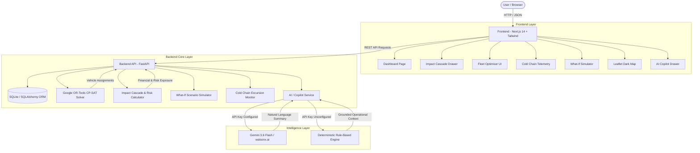

# Architecture

## System Architecture

Clutch Nexus uses a decoupled client-server architecture built on Next.js 14 and FastAPI. The frontend renders a real-time Executive Control Tower interface, while the backend orchestrates data management, mathematical fleet optimization, impact cascade tracking, and AI/rule-based generation.

---

## Components

| Component | Technology | Responsibility |
|---|---|---|
| **Frontend UI** | Next.js 14 (App Router), TypeScript, Tailwind CSS | Executive Control Tower dashboard, interactive Leaflet topology map, Recharts visual analytics, drawer panels, and responsive glassmorphic UI. |
| **Backend API** | FastAPI (Python 3.11+), Uvicorn | Async REST API handling dashboard KPIs, shipments, disruptions, fleet management, telemetry logging, and scenario routing. |
| **Optimization Solver** | Google OR-Tools CP-SAT | Formulates and solves integer programming constraints (capacity, location, temperature, priority) for fleet redeployment with greedy heuristic fallback. |
| **Database & ORM** | SQLite, SQLAlchemy, Pydantic v2 | Relational schema storing ports, multi-modal routes, vehicle registries, shipments, disruption events, and cold-chain sensor logs. |
| **Generative AI Layer** | Gemini 3.6 Flash / watsonx.ai (Granite) | Generates natural language disruption executive summaries, risk score narratives, and copilot answers when API keys are configured. |
| **Grounded Fallback Engine** | Python Rule-Based Intelligence | Serves 100% deterministic operational Q&A and recommendations grounded in live database state when external LLM API keys are unconfigured. |

---

## Data Flow

1. **Disruption Ingestion & Cascading Analysis:**
   - Active disruptions (e.g. Mumbai Port Trust closure `DIS-2026-001`) are queried via `GET /api/v1/disruptions/1/cascade`.
   - The backend joins affected ports, routes, and shipments, computing value at risk ($78.845M), P1 critical count (8), cold-chain exposure (5), and average risk score (68.2%).

2. **Fleet Optimization Execution:**
   - Dispatcher requests optimization via `POST /api/v1/fleet/optimise`.
   - The backend passes available vehicles and stranded shipments to `optimiser.py`.
   - Google OR-Tools CP-SAT model evaluates binary assignment variables `x[v][s]` subject to vehicle tonnage/TEU capacity, cold-chain reefer compatibility, and proximity penalties.
   - Solver returns optimal vehicle-to-shipment assignments within <1 second.

3. **Cold-Chain Telemetry Alerting:**
   - IoT sensor readings stream into `ColdChainLog` via SQLite.
   - The system checks readings against per-shipment allowed bounds (`temp_min_c` to `temp_max_c`).
   - Readings exceeding bounds (e.g. SHP-2026-0026 warming to -11.2°C vs -18.0°C threshold) flag `is_excursion=True` and trigger visual UI alert banners.

4. **What-If Scenario Simulation:**
   - User selects a scenario (e.g. JNPT Port Reroute) via `POST /api/v1/whatif/simulate`.
   - Simulator computes baseline vs scenario metrics: delay reduction (108h → 36h), recovered shipments (12), cost delta (+$1.2M), and overall risk score reduction (42%).

5. **AI Copilot & Fallback Query:**
   - User inputs a question in the AI Copilot UI (`POST /api/v1/ai/copilot`).
   - System checks `is_configured()`. If true, delegates to `gemini.py`/`watsonx.py`. If false, uses `_rule_based_*` functions grounded in live SQLite KPIs to respond with zero hallucination.

---

## Security Considerations

- **API Credentials Safety:** All API keys (`GEMINI_API_KEY`, `WATSONX_API_KEY`) are managed exclusively via environment variables (`.env`) and excluded from source control via `.gitignore`.
- **Stateless API Design:** The FastAPI backend is stateless; all operational state is persisted in SQLite with clean transaction boundaries.
- **CORS Policies:** Configured with specific allowed origins (`http://localhost:3000` and production Vercel origins) to restrict unauthorized domain access.

---

## Scalability Notes

- **Database Scaling:** The SQLite prototype can be seamlessly upgraded to PostgreSQL or Amazon Aurora using SQLAlchemy configuration changes without modifying business logic.
- **Async High-Throughput Ingestion:** FastAPI's async event loop can handle thousands of IoT sensor telemetry updates per second when coupled with Redis or RabbitMQ message queues.
- **Distributed Solving:** Solvers in `optimiser.py` can be decoupled into Celery worker nodes for massive multi-commodity network flow problems.

